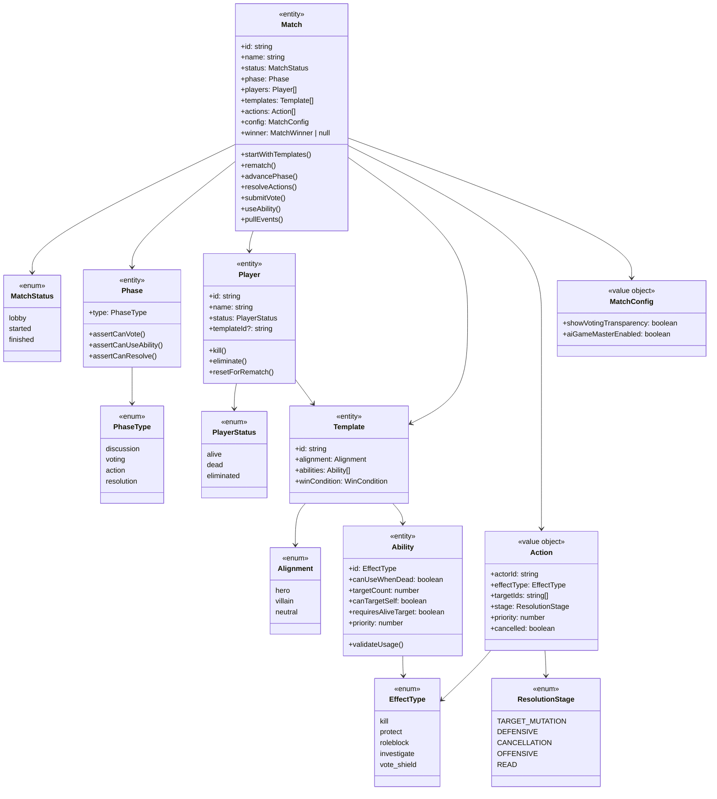
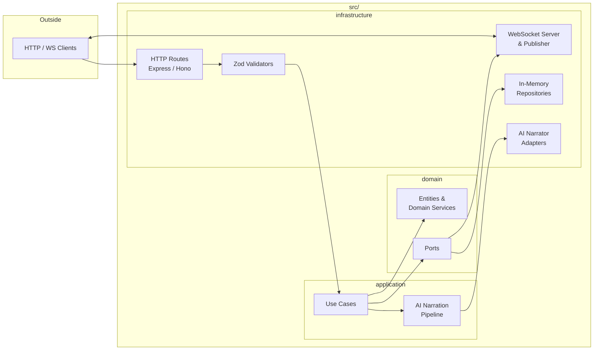
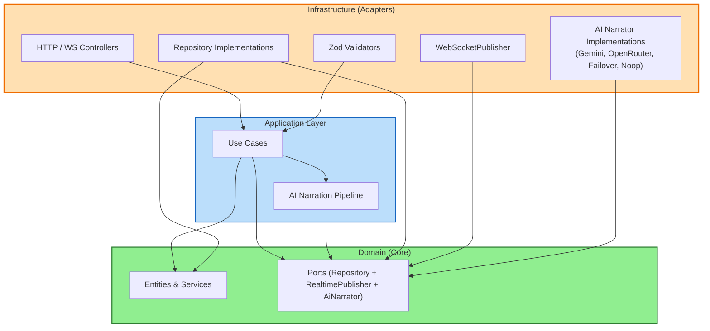
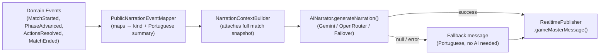
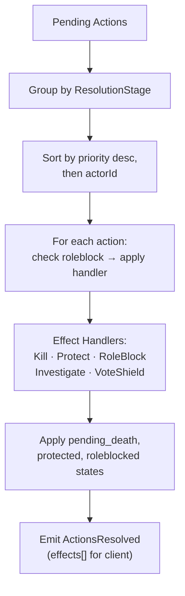
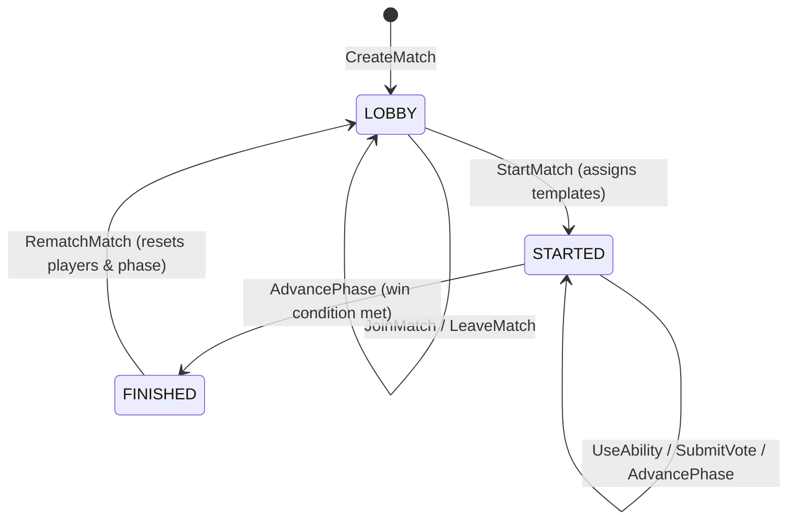

# Architecture

## Domain Model

## Layer Structure

## Clean Architecture (Hexagonal)

Domain entities and ports live in the center. Arrows flow from "defines" to "uses":

- Entities → Use Cases (domain defines, use cases use)
- Ports → Use Cases (domain defines, use cases use)
- Ports → Repositories (domain defines, repositories implement)

No arrows point into domain — it's the foundation with zero dependencies.

## AI Narrator Pipeline

When `aiGameMasterEnabled` is `true` on a match, key events trigger narration after `StartMatch` and `AdvancePhase`:

**Narration kinds:** `start` · `phase` · `resolution` · `elimination` · `end`

**Events ignored:** `PlayerJoined`, `PlayerLeft`, `VoteSubmitted`, `MatchRematched`

**Provider selection** (`createAiNarratorFromEnv`):
- `GEMINI_API_KEY` → `GeminiAiNarrator`
- `OPENROUTER_API_KEY` → `OpenRouterAiNarrator`
- Both keys → `FailoverAiNarrator` (primary + secondary)
- Neither → `NoopAiNarrator` (silent)

## Action Resolution

Actions recorded during the action phase are processed when the phase advances to `resolution`:

**Stage execution order:** `TARGET_MUTATION` → `DEFENSIVE` → `CANCELLATION` → `OFFENSIVE` → `READ`

## Match Lifecycle

## Key Patterns

- **Domain Entities**: Pure business logic with no external dependencies
- **Ports**: Repository, RealtimePublisher, and AiNarrator interfaces define all external contracts
- **Use Cases**: Orchestrate domain logic; depend on ports, never on implementations
- **DI Container**: `container.ts` wires everything; swap implementations without touching business logic
- **Zod Validators**: Validate request data at the HTTP layer (infrastructure)
- **Entity Isolation**: Domain entities never call infrastructure or outer layers
- **Domain Events**: Entities emit events via `pullEvents()`; use cases broadcast them
- **AI Narrator**: Optional narration layer; fully isolated behind the `AiNarrator` port with failover support
- **Match Rematch**: `Match.rematch()` resets status → LOBBY, clears actions/votes/winner, calls `player.resetForRematch()` on each player
