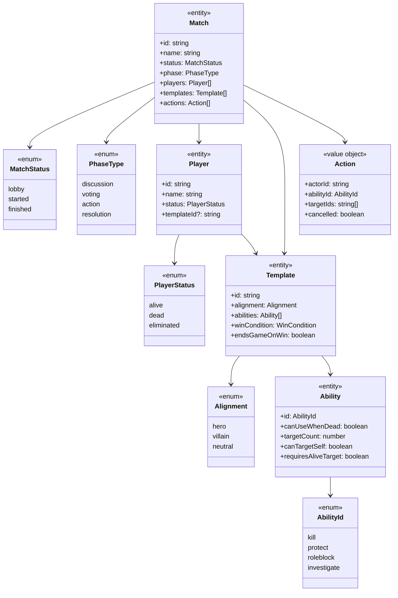
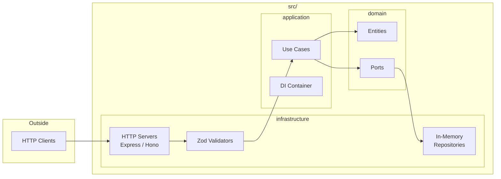
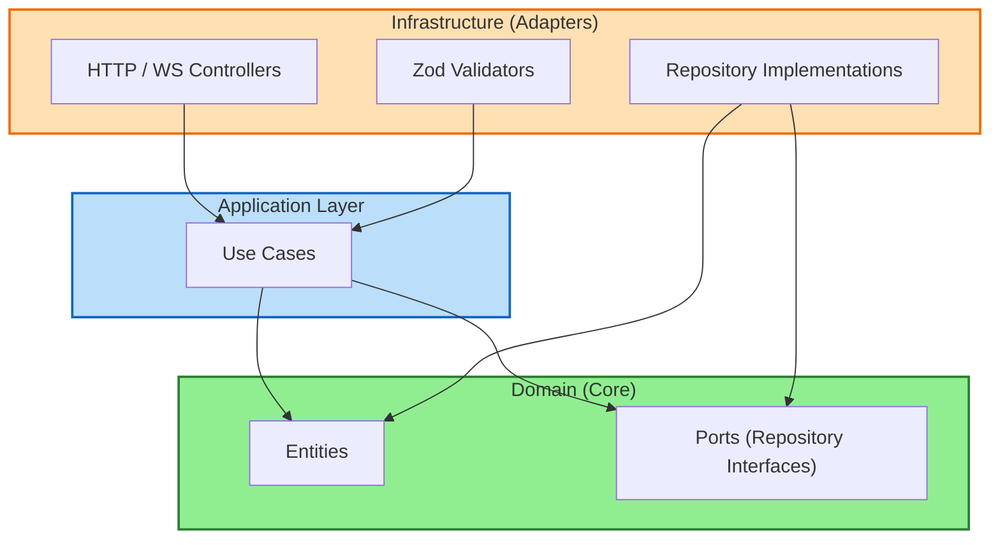

# Architecture

## Domain Model

## Layer Structure

## Clean Architecture (Hexagonal)

Domain entities and ports live in the center. Arrows flow from "defines" to "uses":

- Entities → Use Cases (domain defines, use cases use)
- Ports → Use Cases (domain defines, use cases use)
- Ports → Repositories (domain defines, repositories implement)

No arrows point into domain - it's the foundation with zero dependencies.

## Key Patterns

- **Domain Entities**: Pure business logic with no external dependencies
- **Ports**: Repository interfaces define data access contracts
- **Use Cases**: Orchestrate domain logic, depend on ports (not implementations)
- **DI Container**: Wires dependencies, enables easy swapping of implementations
- **Zod Validators**: Validate request data at the HTTP layer (infrastructure)
- **Entity Isolation**: Domain entities never call infrastructure or outer layers
- **Repository Returns**: Infrastructure returns domain entities (infra depends on domain, not vice versa)
