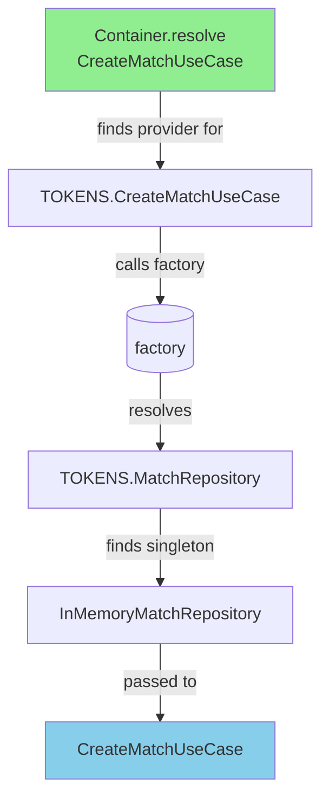

# Container & Inversion of Control

## Inversion of Control (IoC)

**Don't call the framework, let the framework call you.**

Traditional code: you create objects, call functions, control the flow.

With IoC: the container creates objects, you just use them.

```typescript
// Traditional - YOU control creation
const repo = new InMemoryMatchRepository();
const useCase = new CreateMatchUseCase(repo);
const result = await useCase.execute();

// IoC - container controls creation
const container = buildContainer();
const useCase = container.resolve("CreateMatchUseCase"); // ready to use!
```

## The Container

A container (or service locator) manages dependency creation and wiring.

```typescript
// Simple container
class Container {
  private providers = new Map<string, any>();

  register<T>(token: string, factory: (container: Container) => T) {
    this.providers.set(token, factory);
  }

  resolve<T>(token: string): T {
    const factory = this.providers.get(token);
    return factory(this);
  }
}
```

## Singleton vs Factory

| Type | Behavior | Use When |
|------|----------|----------|
| **Singleton** | One instance shared | Expensive to create (DB connections) |
| **Factory** | New instance each time | Stateless, lightweight |

## In This Project

Real container in `src/container.ts`:

```typescript
export function buildContainer() {
  const container = new Container();

  // Singleton - one InMemoryMatchRepository for entire app
  container.register(
    TOKENS.MatchRepository,
    () => new InMemoryMatchRepository(),
    { singleton: true },
  );

  // Factory - new CreateMatchUseCase each time (or singleton too)
  container.register(
    TOKENS.CreateMatchUseCase,
    (c) => new CreateMatchUseCase(c.resolve(TOKENS.MatchRepository)),
  );

  return container;
}
```

## How It Works



## Tokens

Tokens prevent string typos and carry type information:

```typescript
// Branded token - string + type info
export type Token<T> = string & { __type?: T };

export const TOKENS = {
  MatchRepository: "MatchRepository" as Token<MatchRepository>,
  CreateMatchUseCase: "CreateMatchUseCase" as Token<CreateMatchUseCase>,
};

// Type-safe resolution!
const repo = container.resolve<MatchRepository>(TOKENS.MatchRepository);
```

## Using the Container

```typescript
// src/app.ts or server setup
import { buildContainer } from "./container";

const container = buildContainer();

// In HTTP handler
server.post("/match", async (req, res) => {
  const useCase = container.resolve(TOKENS.CreateMatchUseCase);
  const result = await useCase.execute(req.body);
  res.json(result);
});
```

## Why This Matters

| Without Container | With Container |
|-------------------|-----------------|
| Manual wiring everywhere | Centralized configuration |
| Hard to swap implementations | Easy: change one register() call |
| Testing requires hacking | Pass mocks at container level |
| Implicit dependencies | Explicit dependencies |

## Key Takeaway

The container implements **Inversion of Control** - instead of your code creating dependencies, the container does it. Your code just requests what it needs.

See `src/container.ts` for the full implementation.

---

[← Back to Overview](./01-overview.md)
