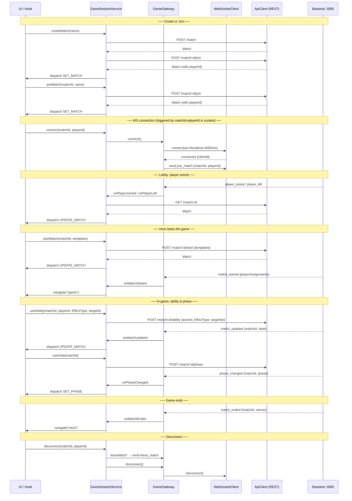

# 🎮 Social Deduction Game --- Frontend

Frontend client for the Social Deduction Game.

This application is responsible for:

- Rendering game state
- Managing WebSocket connection
- Handling user interactions (actions, votes, templates)
- Synchronizing real-time updates from the backend

---

## 🏗 Architecture Overview

The frontend follows a layered architecture inspired by the backend
structure.

    src/
    ├── context/                # React context + orchestration service
    │   ├── GameContext.tsx       # GameProvider, useGame, reducer
    │   └── GameSessionService.ts # Orchestrates gateway + api + dispatch
    │
    ├── infrastructure/         # External adapters (no React)
    │   ├── http/
    │   │   └── ApiClient.ts      # Typed REST client
    │   └── ws/
    │       ├── WebSocketClient.ts  # Low-level WS transport
    │       └── GameGateway.ts      # Domain-aware WS bridge
    │
    ├── types/                  # Shared domain types (pure TS)
    │   ├── match.ts
    │   └── gameActions.ts
    │
    ├── features/               # Feature-based UI modules
    │   ├── home/
    │   ├── lobby/
    │   ├── game/
    │   └── end/
    │
    ├── shared/                 # Reusable components & utilities
    └── App.tsx

---

## 🔌 WebSocket & API Communication

### Connection lifecycle



---

## 🚀 Development

Install dependencies:

```bash
npm install
```

Run development server:

```bash
npm run dev
```

---

## 🧪 Testing

```bash
npm run test
```

---

## 🧠 Design Principles

- UI components are pure and declarative
- No direct WebSocket usage inside components
- All side-effects live in hooks
- Transport layer is isolated
- Message contracts mirror backend events

---

## 📡 Communication Strategy

- REST for initial match/session creation
- WebSocket for real-time game updates
- Optimistic UI updates (future enhancement)
- Reconnection strategy (future enhancement)

---

## 🏆 Long-Term Goals

- Shared TypeScript types with backend
- Message schema validation
- Event-driven client architecture
- Phase-based rendering system
