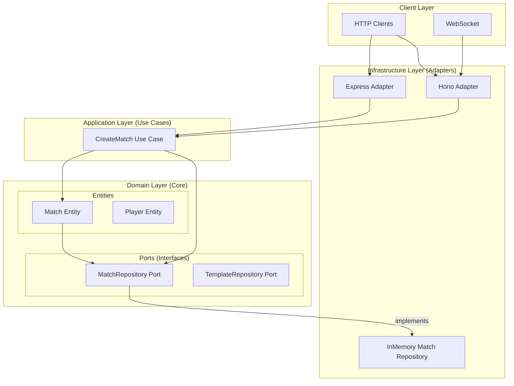
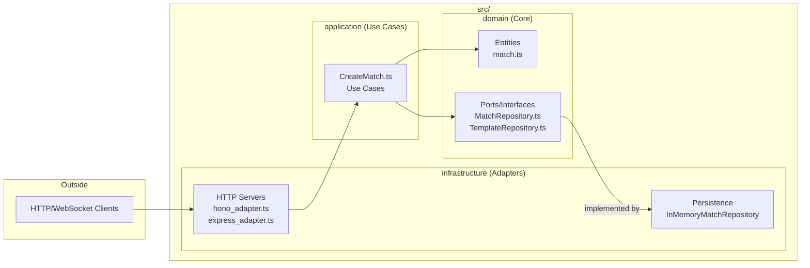

# Architecture

This project follows **Clean Architecture** principles with **Hexagonal Ports & Adapters** pattern.

## Overview

## Layer Diagram

## Directory Structure

| Layer | Folder | Responsibility |
|-------|--------|----------------|
| **Domain** | `src/domain/` | Entities, business rules, port interfaces |
| **Application** | `src/application/` | Use cases orchestrating domain logic |
| **Infrastructure** | `src/infrastructure/` | Adapters (HTTP servers, persistence) |

## Dependency Rule

- `application` depends on `domain`
- `infrastructure` depends on `domain` (via ports)
- `domain` has **no** external dependencies

## Key Files

- **Domain**: `src/domain/entity/match.ts`, `src/domain/ports/persistance/MatchRepository.ts`
- **Application**: `src/application/CreateMatch.ts`
- **Infrastructure**: `src/infrastructure/http/hono_adapter.ts`, `src/infrastructure/persistence/InMemoryMatchRepository.ts`
