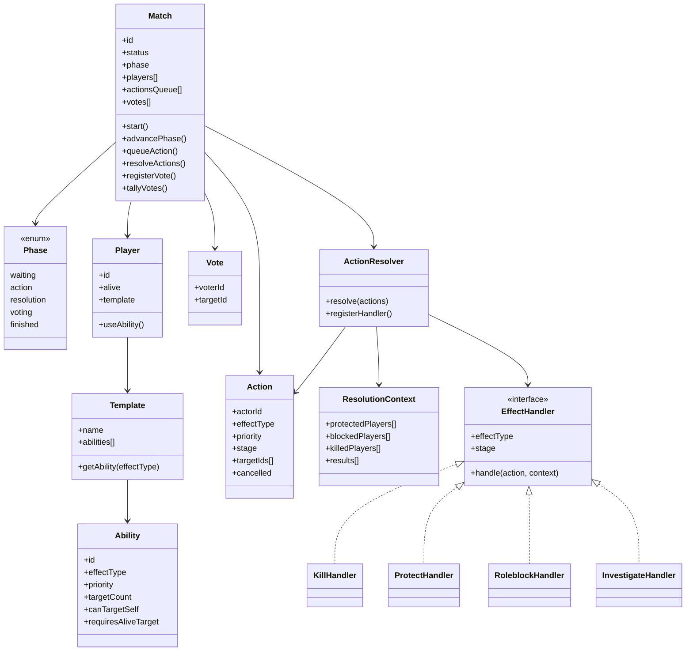
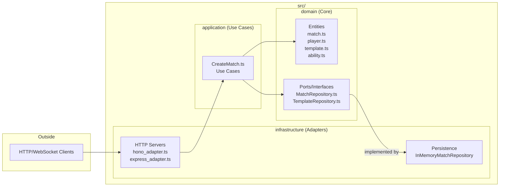

# Architecture

## Overview

```mermaid
classDiagram

%% =========================
%% Core Domain
%% =========================

class Match {
  +id
  +status
  +phase
  +players[]
  +actionsQueue[]
  +votes[]
  +start()
  +advancePhase()
  +queueAction()
  +resolveActions()
  +registerVote()
  +tallyVotes()
}

class Phase {
  <<enum>>
  waiting
  action
  resolution
  voting
  finished
}

class Player {
  +id
  +alive
  +template
  +useAbility()
}

class Template {
  +name
  +abilities[]
  +getAbility(effectType)
}

class Ability {
  +id
  +effectType
  +priority
  +targetCount
  +canTargetSelf
  +requiresAliveTarget
}

class Action {
  +actorId
  +effectType
  +priority
  +stage
  +targetIds[]
  +cancelled
}

class Vote {
  +voterId
  +targetId
}

%% =========================
%% Resolution Subsystem
%% =========================

class ActionResolver {
  +resolve(actions)
  +registerHandler()
}

class ResolutionContext {
  +protectedPlayers[]
  +blockedPlayers[]
  +killedPlayers[]
  +results[]
}

class EffectHandler {
  <<interface>>
  +effectType
  +stage
  +handle(action, context)
}

%% =========================
%% Relationships
%% =========================

Match --> Phase
Match --> Player
Match --> Action
Match --> Vote

Player --> Template
Template --> Ability

Match --> ActionResolver
ActionResolver --> EffectHandler
ActionResolver --> ResolutionContext
ActionResolver --> Action

EffectHandler <|.. KillHandler
EffectHandler <|.. ProtectHandler
EffectHandler <|.. RoleblockHandler
EffectHandler <|.. InvestigateHandler
```

## Layer Diagram

```mermaid
flowchart LR
    subgraph "Outside"
        Client[HTTP/WebSocket Clients]
    end

    subgraph "src/"
        subgraph "infrastructure (Adapters)"
            HTTP[HTTP Servers<br/>hono_adapter.ts<br/>express_adapter.ts]
            Persistence[Persistence<br/>InMemoryMatchRepository]
        end

        subgraph "application (Use Cases)"
            UseCases[CreateMatch.ts<br/>Use Cases]
        end

        subgraph "domain (Core)"
            Entities[Entities<br/>match.ts<br/>player.ts<br/>template.ts<br/>ability.ts]
            Ports[Ports/Interfaces<br/>MatchRepository.ts<br/>TemplateRepository.ts]
        end
    end

    Client --> HTTP
    HTTP --> UseCases
    UseCases --> Ports
    UseCases --> Entities
    Ports -->|implemented by| Persistence
```
