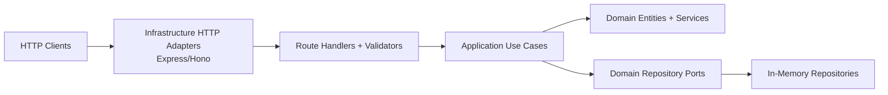
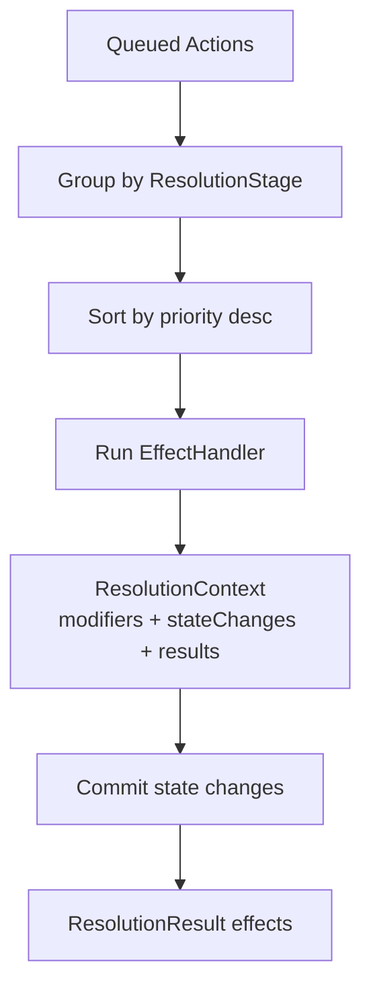

# Architecture

This project uses Clean Architecture with ports/adapters and an effect-driven game engine.

## Core Model

- **Effect is identity**: abilities are defined by `EffectType` (`kill`, `protect`, `roleblock`, `investigate`) and config, not by hardcoded role classes.
- **Composable templates**: each template (role) is a composition of abilities with per-ability config (`priority`, targeting rules, dead/alive usage rules).
- **Queued actions + resolver pipeline**: actions are queued during action phase, then resolved when phase advances to `resolution`.

## Layered Design

### Dependency Rule

- `domain` does not depend on `application` or `infrastructure`.
- `application` depends on `domain`.
- `infrastructure` depends on `application`/`domain` contracts.

The fitness test at `src/__test__/fitness-functions/architecture-fitness.spec.ts` enforces that domain code does not import from infrastructure.

## Resolution Architecture

The action resolver is a staged pipeline with commit semantics:

1. `Match.useAbility(...)` validates usage and snapshots action metadata (`effectType`, `priority`, `stage`).
2. `AdvancePhaseUseCase` advances phase.
3. If phase becomes `resolution`, it calls `match.resolveActions(actionResolver)`.
4. `ActionResolver` executes handlers by stage and priority.
5. Handlers write to `ResolutionContext` (modifiers, pending state changes, effect results).
6. Commit phase applies pending state changes (for now: `pending_death -> player.kill()`).
7. Match action queue is cleared.

### Resolution Stages

- `TARGET_MUTATION` (0)
- `DEFENSIVE` (1)
- `CANCELLATION` (2)
- `OFFENSIVE` (3)
- `READ` (4)

Built-in handlers:

- `RoleblockHandler` -> `CANCELLATION`
- `ProtectHandler` -> `DEFENSIVE`
- `KillHandler` -> `OFFENSIVE`
- `InvestigateHandler` -> `READ`

## Main Components

### Domain Entities (`src/domain/entity`)

- `Match`: lifecycle, phase, action queue, ability usage, resolution integration.
- `Player`: alive/dead status and template assignment.
- `Template`: alignment + ability composition (+ optional `name`).
- `Ability`: effect type + full targeting/usage config + default priority.
- `Action`: immutable snapshot used by resolver (`effectType`, `priority`, `stage`, `targetIds`).
- `Phase`: phase transitions (`discussion -> voting -> action -> resolution -> ...`).

### Domain Services (`src/domain/services`)

- `EffectHandler` + `ResolutionStage`: handler contract and staged execution model.
- `ResolutionContext`: per-round scratchpad (modifiers, pending state changes, effect results).
- `ActionResolver`: orchestrates staged execution and commit phase.

### Application Use Cases (`src/application`)

- `CreateMatch`
- `ListMatchs`
- `GetMatch`
- `JoinMatch`
- `StartMatch` (full template/ability config input)
- `UseAbility` (`effectType` input)
- `AdvancePhase` (auto-runs resolution when entering `resolution`)

### Infrastructure (`src/infrastructure`)

- HTTP adapters: `express_adapter.ts`, `hono_adapter.ts`
- Request validation: Zod schemas in `http/validators/match.ts`
- Persistence adapters: in-memory repositories
- Route registration in `http/routes/match.ts`

### Composition Root

- `src/container.ts` wires repositories, use cases, and a singleton `ActionResolver` with built-in handlers.
