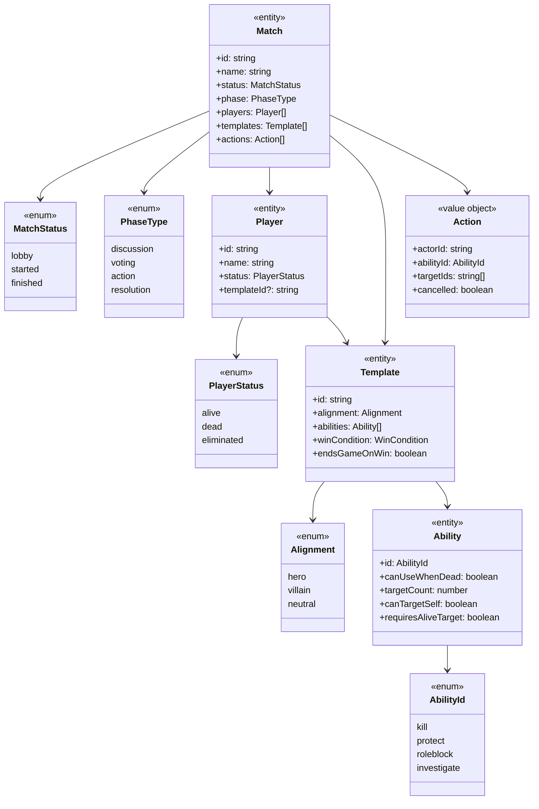
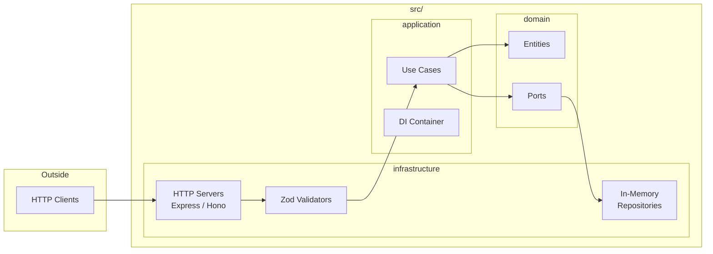

# Architecture

## Domain Model

## Layer Structure

## Key Patterns

- **Domain Entities**: Pure business logic with no external dependencies
- **Ports**: Repository interfaces define data access contracts
- **Use Cases**: Orchestrate domain logic, depend on ports (not implementations)
- **DI Container**: Wires dependencies, enables easy swapping of implementations
- **Zod Validators**: Validate request data at the HTTP layer (infrastructure)
