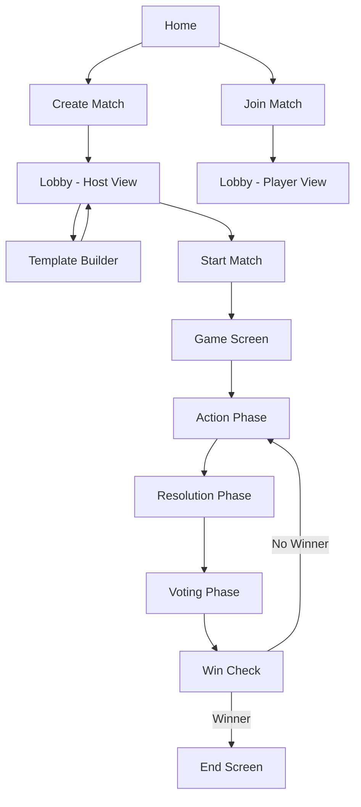
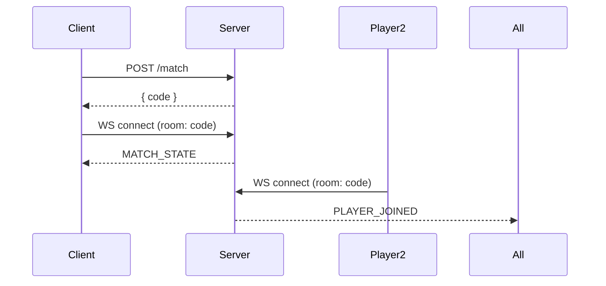
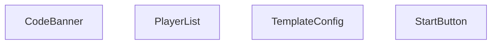
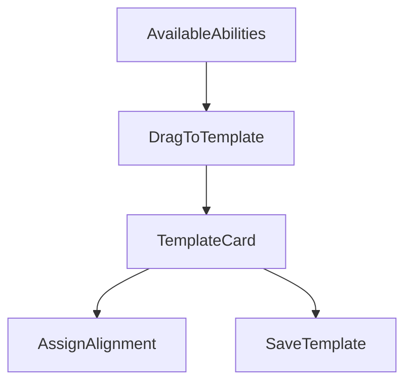
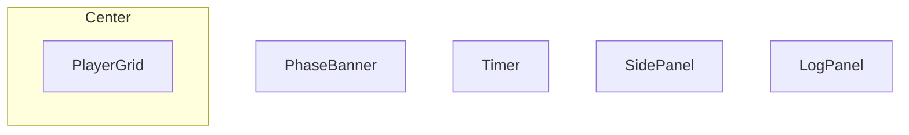
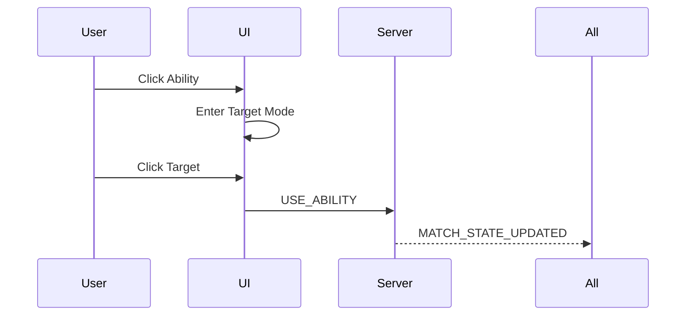
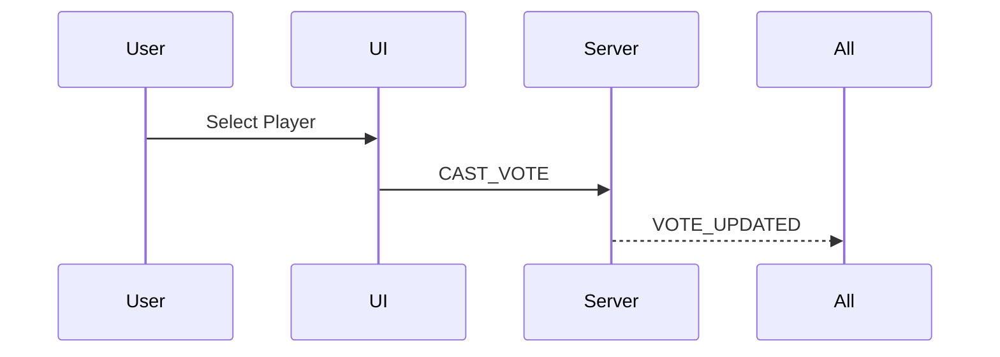

# 🎮 Social Deduction Game -- Frontend Architecture Plan

---

# 🧭 Global Application Flow



---

# 📄 Routes

    /                 → Home
    /match/:code      → Lobby OR Game (depends on status)
    /match/:code/end  → End Screen

---

# 🔌 WebSocket Lifecycle



---

# 🏠 Lobby Screen

## Host View

- Display match code
- Live player list
- Template builder access
- Start match button

## Player View

- Live player list
- Waiting for host to start



---

# 🃏 Template Builder



---

# 🎮 Game Screen Layout



---

# ⚔️ Action Phase Flow



---

# 🗳 Voting Phase Flow



---

# 🏁 End Screen

- Display winner
- Reveal roles
- Restart button (host only)

---

# 🧠 Core Frontend State Model

```ts
GameSession {
  match
  socket
  currentUserId
  role
}
```

Frontend should passively render authoritative backend state.

---

# 📁 Suggested Folder Structure

    src/
     ├── app/
     │   └── router.tsx
     │
     ├── features/
     │   ├── session/
     │   │   ├── useSocket.ts
     │   │   ├── useMatch.ts
     │   │   └── session.store.ts
     │   │
     │   ├── lobby/
     │   │   ├── LobbyView.tsx
     │   │   ├── TemplateBuilder.tsx
     │   │
     │   ├── game/
     │   │   ├── GameView.tsx
     │   │   ├── ActionPhase.tsx
     │   │   ├── VotingPhase.tsx
     │   │   ├── ResolutionPhase.tsx
     │   │
     │   └── end/
     │       └── EndView.tsx
     │
     ├── shared/
     │   ├── PlayerCard.tsx
     │   ├── AbilityCard.tsx
     │   └── PhaseBanner.tsx

---

# 🚀 MVP Principles

- WebSocket-driven state
- Phase-based rendering
- No frontend win logic
- Backend authoritative decisions
- Minimal animations for v1

---

# ✅ Final Concept

Backend = Deterministic game engine\
Frontend = Real-time state renderer

Clean separation of responsibilities.\
Scalable and production-ready architecture.
