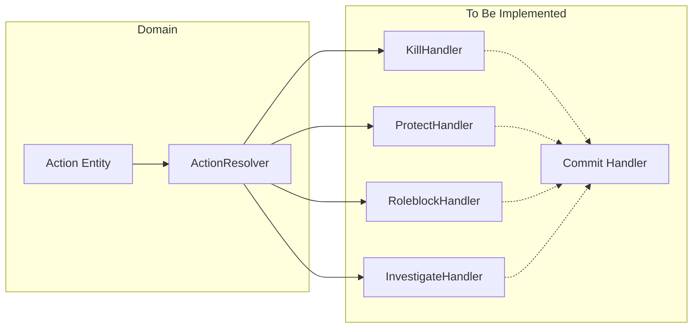

# Implementation Spec: Effect-First Resolution Plan

This folder expands `plan.md` into file-by-file implementation specs.

## Suggested Execution Order
1. Step 01 to 05 (domain core)
2. Step 06 to 10 (application and API wiring)
3. Step 11 (tests and regression hardening)

## Step Files
- `step-01-ability-entity.md`
- `step-02-action-snapshot.md`
- `step-03-template-shape.md`
- `step-04-match-integration.md`
- `step-05-resolution-system.md`
- `step-06-start-match.md`
- `step-07-advance-phase.md`
- `step-08-use-ability.md`
- `step-09-validators.md`
- `step-10-container-di.md`
- `step-11-tests.md`

## Resolution Pipeline

## Definition of Done
- `AbilityId` usage fully migrated to `EffectType`
- Resolution executed through staged pipeline with commit phase
- Start payload supports composed abilities with optional config
- Resolution auto-runs on phase transition to `resolution`
- E2E tests cover roleblock, protect, kill, investigate, and clear-actions
